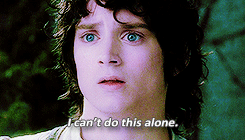

# Lab 1 - Git going!

## First Option for "Your Turn"" 

  
<ol style="color: white">
  <li>Fork the lab repo from <a href="https://github.com/agron590-ISU/lab" target=_blank style="color:yellow">https://github.com/agron590-ISU/lab</a></li>
  <li>Edit the repo in some way.
  <ul>
  <li>Ideas: Edit the readme, add a new file in the 01 folder, edit these slides, go nuts!</li>
  </ul></li>
  <li>Create a pull request with your changes.</li>
</ol>

## Second Option for "Your Turn"" 

  
<ol style="color: white">
  <li>Fork the lab repo from <a href="https://github.com/agron590-ISU/lab" target=_blank style="color:yellow">https://github.com/agron590-ISU/lab</a></li>
  <li>Edit the repo in some way.
  <ul>
  <li>Ideas: Edit the readme, add a new file in the 01 folder, edit these slides, go nuts!</li>
  </ul></li>
  <li>Create a pull request with your changes.</li>
  <li> </li>
  <h3>Chose whichever option you like more. But, please, do not use that blue background anymore! It's painful to read white text against those bubbles! </h3>
</ol>

## How I should do this?

  <l>I want to change color of the heading to red
  , or orange, 
  or blue. 
  <l>But my attempts are failing.</l>
  <l></l>

## Our repo

